# TRGN Final Project
## Date:  12/6/2022
## Title: Using DESeq2 to Analayze Gene Expression Differences in Triple-Negative and Hormone-Receptor-Positive Breast Cancer 

# Title

Genomic and transcriptomic analysis of BRCA-associated triple negative breast cancer.

# Author:

Batul Al-zubeidy

# Overview:

While triple negative breast cancer accounts for about 15% of total invasive breast cancer cases diagnosed in the US every year, it represents approximately 30% of BRCA-associated breast tumors.  This aggressive subtype is characterized by lack of expression of the estrogen, and progesterone hormone receptors (both at <1% expression), as well as decreased expression of the membrane surface protein Human Epidermal Growth Factor Receptor 2 (HER2) on epithelial mammary cells.    Triple negative tumors carry worse prognosis compared with hormone-receptor positive cancers with 5-year-survival rates ranging from 12%-91% for stage I-IV, respectively (American Cancer Society).  
https://www.cancer.org/cancer/breast-cancer/about/types-of-breast-cancer/triple-negative.html
	These tumor islands express significant heterogeneity reflecting various genetic variations that likely explain their variable clinical response/outcome.  This project will utilize TCGA high throughput genomic data to investigate BRCA female patients (n=10) diagnosed with triple negative breast cancer between the ages of 26 and 90.  Similarily, I will analyze BRCA female patients diagnosed with ER+ PR+ HER2-non-amplified (n=10) diagnosed between the ages of 26 and 90, too.  I will be controlling for race and ethnicity.  
I will be analyzing gene expression through RNA sequencing to identify the mutational burdens as possible predictors of clinical outcome (such as stage, clinical response, and disease free survival).  

# Data:

Use cBioPortal combined studies: 
-Breast invasive carcinoma (TCGA, Cell 2015)
-Breast invasive carcinoma (TCGA, Firehose legacy)
-Breast invasive carcinoma (TCGA, Nature 2012)
-Breast invasive carcinoma (TCGA, PanCancer Atlas)

-CSV file with the included triple-negative breast cancer samples is attached as "combined_study_clinical_data-3.csv"
-CSV file with the included ER+ PR+ HER2-non-amplified breast cancer samples is attached as "combined_study_clinical_data.csv"
-CSV file with significant genes between both groups included (genes listed with their HUGO names, not Ensembl)

Clinical data obtained from (cBioPortal):
https://www.cbioportal.org/study/clinicalData?id=brca_tcga_pub2015%2Cbrca_tcga%2Cbrca_tcga_pub%2Cbrca_tcga_pan_can_atlas_2018

Genomic/transcriptomics from: 
https://portal.gdc.cancer.gov

I will utilize the package DeSEQ2 (http://bioconductor.org/packages/release/bioc/vignettes/DESeq2.html)

# Known Issues:
-Small sample sizes were used to run the test for differential expression, which likely obsecures the true gene expression.  
-The data obtained from TCGA cases were cross examined with portal.gdc.cancer.gov dataset to obtain the clinical pathology, including estrogn/progestrone/HER2 biomarkers.  
-The RNA-sequence data showed significantly different PCA analyses between triple negative and estorgen-receptor-positive breast cancer; much greater differences than anticipated.  

# Requirements:
This project requires RStudio.
The data was downloaded from cBioPortal (https://www.cbioportal.org/study/clinicalData?id=brca_tcga_pub2015%2Cbrca_tcga%2Cbrca_tcga_pub%2Cbrca_tcga_pan_can_atlas_2018) and Genomic/transcriptomics from (https://portal.gdc.cancer.gov). 
There are various installations required (see Final project for the entire list), which were downloaded from http://bioconductor.org/packages


## Data input and construct a DESeqDataSet:

```r
library("tximport")
library("readr")
library("DESeq2")
```

```
## Warning: package 'DESeq2' was built under R version 4.2.2
```

```
## Loading required package: S4Vectors
```

```
## Loading required package: stats4
```

```
## Loading required package: BiocGenerics
```

```
## 
## Attaching package: 'BiocGenerics'
```

```
## The following objects are masked from 'package:stats':
## 
##     IQR, mad, sd, var, xtabs
```

```
## The following objects are masked from 'package:base':
## 
##     anyDuplicated, aperm, append, as.data.frame, basename, cbind,
##     colnames, dirname, do.call, duplicated, eval, evalq, Filter, Find,
##     get, grep, grepl, intersect, is.unsorted, lapply, Map, mapply,
##     match, mget, order, paste, pmax, pmax.int, pmin, pmin.int,
##     Position, rank, rbind, Reduce, rownames, sapply, setdiff, sort,
##     table, tapply, union, unique, unsplit, which.max, which.min
```

```
## 
## Attaching package: 'S4Vectors'
```

```
## The following objects are masked from 'package:base':
## 
##     expand.grid, I, unname
```

```
## Loading required package: IRanges
```

```
## Loading required package: GenomicRanges
```

```
## Loading required package: GenomeInfoDb
```

```
## Warning: package 'GenomeInfoDb' was built under R version 4.2.2
```

```
## Loading required package: SummarizedExperiment
```

```
## Loading required package: MatrixGenerics
```

```
## Loading required package: matrixStats
```

```
## 
## Attaching package: 'MatrixGenerics'
```

```
## The following objects are masked from 'package:matrixStats':
## 
##     colAlls, colAnyNAs, colAnys, colAvgsPerRowSet, colCollapse,
##     colCounts, colCummaxs, colCummins, colCumprods, colCumsums,
##     colDiffs, colIQRDiffs, colIQRs, colLogSumExps, colMadDiffs,
##     colMads, colMaxs, colMeans2, colMedians, colMins, colOrderStats,
##     colProds, colQuantiles, colRanges, colRanks, colSdDiffs, colSds,
##     colSums2, colTabulates, colVarDiffs, colVars, colWeightedMads,
##     colWeightedMeans, colWeightedMedians, colWeightedSds,
##     colWeightedVars, rowAlls, rowAnyNAs, rowAnys, rowAvgsPerColSet,
##     rowCollapse, rowCounts, rowCummaxs, rowCummins, rowCumprods,
##     rowCumsums, rowDiffs, rowIQRDiffs, rowIQRs, rowLogSumExps,
##     rowMadDiffs, rowMads, rowMaxs, rowMeans2, rowMedians, rowMins,
##     rowOrderStats, rowProds, rowQuantiles, rowRanges, rowRanks,
##     rowSdDiffs, rowSds, rowSums2, rowTabulates, rowVarDiffs, rowVars,
##     rowWeightedMads, rowWeightedMeans, rowWeightedMedians,
##     rowWeightedSds, rowWeightedVars
```

```
## Loading required package: Biobase
```

```
## Welcome to Bioconductor
## 
##     Vignettes contain introductory material; view with
##     'browseVignettes()'. To cite Bioconductor, see
##     'citation("Biobase")', and for packages 'citation("pkgname")'.
```

```
## 
## Attaching package: 'Biobase'
```

```
## The following object is masked from 'package:MatrixGenerics':
## 
##     rowMedians
```

```
## The following objects are masked from 'package:matrixStats':
## 
##     anyMissing, rowMedians
```

```r
#dir <- system.file("extdata", package="tximportData")
#counts <- read.table(file.path(dir,"sample003.csv"), header=TRUE)
#counts$condition <- factor(rep(c("TNB","HR"),each=20))
#rownames(counts) <- samples$run
#counts[,c("TNB_sample1","TNB_sample2","TNB_sample3","TNB_sample4")]
```


```r
counts <- read.csv("/Users/batulal-zubeidy/Desktop/TRGNFinal/TNB_HR_Joined_Counts.csv", header = TRUE, row.names = 1, sep = ",")
metadata <- read.csv("/Users/batulal-zubeidy/Desktop/TRGNFinal/metadata.csv", header = TRUE, row.names = 1, sep = ",")
```


```r
head(counts)
```

```
##                    TNB_Sample1 TNB_Sample2 TNB_Sample3 TNB_Sample4 TNB_Sample5
## ENSG00000000003.15     11.5131     16.1181     31.7164     14.1300     26.1442
## ENSG00000000005.6       0.0133      0.0746      0.0568      0.1357      1.7059
## ENSG00000000419.13     51.8071     49.7934     17.8525     39.6740     39.5339
## ENSG00000000457.14      3.1431      2.9941      2.0035      2.9562      2.9588
## ENSG00000000460.17      2.6883      3.6457      2.4081      1.7676      3.5933
## ENSG00000000938.13      1.6224      7.6889      0.9116      2.7384      2.2481
##                    TNB_Sample6 TNB_Sample7 TNB_Sample8 TNB_Sample9 TNB_Sample10
## ENSG00000000003.15     22.1580     20.4186     18.7707     11.0678      33.6260
## ENSG00000000005.6       0.0146      0.0177      0.0098      0.0647       0.1156
## ENSG00000000419.13     32.1221     20.9227     20.0057     44.3501      37.0361
## ENSG00000000457.14      2.9805      2.0324      6.3745      5.9706       4.4702
## ENSG00000000460.17      1.8406      0.6442      4.9303      5.2918       6.7108
## ENSG00000000938.13      3.7959      9.4023      2.2914      1.9715       5.2952
##                    HR_Sample1 HR_Sample2 HR_Sample3 HR_Sample4 HR_Sample5
## ENSG00000000003.15    10.1119     5.9878    23.5964     3.5103    13.5934
## ENSG00000000005.6      0.1033     0.0145     0.0436     0.0134     0.0293
## ENSG00000000419.13    20.8171    43.6567    39.3780    28.6561    24.4397
## ENSG00000000457.14     8.0737     4.1857     8.6708     1.6970     3.8267
## ENSG00000000460.17     1.6924     1.6648     3.6589     1.1369     1.7474
## ENSG00000000938.13     1.1837     6.5869     0.5085     2.3920     1.7150
##                    HR_Sample6 HR_Sample7 HR_Sample8 HR_Sample9 HR_Sample10
## ENSG00000000003.15     4.0979    12.6241    35.9733     3.4008     13.4414
## ENSG00000000005.6      0.1173     0.8171     0.0000     0.0757      0.8132
## ENSG00000000419.13    60.9148    38.5795    42.6416    29.0403     21.0414
## ENSG00000000457.14     5.9742     3.9350     4.5274     3.7005      3.1490
## ENSG00000000460.17     3.1136     1.0277     1.8861     1.3321      0.8887
## ENSG00000000938.13     2.1563     2.7212     0.5161     4.2684      2.0985
```


```r
dds <- DESeqDataSetFromMatrix(countData = round(counts), colData = metadata, design = ~condition)
```

```
## converting counts to integer mode
```

```
## Warning in DESeqDataSet(se, design = design, ignoreRank): some variables in
## design formula are characters, converting to factors
```


```r
#dds <- DESeqDataSetFromTximport(counts,colData = samples,design = ~ condition)
```

```r
#samplesFiles <- grep("TNB_sample1",list.files("TNB_HR_Joined"), value = TRUE)
```

```r
#counts <- counts[which(rowSums(counts) >1),]
```

```r
#condition <- factor(c("TNB", "TNB", "TNB", "TNB", "TNB", "TNB", "TNB", "TNB", "TNB", "TNB", "HR", "HR", "HR", "HR", "HR", "HR", "HR", "HR", "HR", "HR"))
```

```r
coldata <- data.frame(row.names = colnames(counts), condition)
```


```r
#coldata
```


```r
#rownames(coldata) <- sub("fb", "", rownames(coldata))
#all(rownames(coldata) %in% colnames(cts))
```


```r
#all(rownames(coldata) == colnames(cts))
```


```r
dds <- DESeqDataSetFromMatrix(countData = round(counts), colData = metadata, design = ~condition)
```

```
## converting counts to integer mode
```

```
## Warning in DESeqDataSet(se, design = design, ignoreRank): some variables in
## design formula are characters, converting to factors
```


```r
library("DESeq2")
dds <- DESeqDataSetFromMatrix(countData = round(counts), colData = metadata, design = ~condition)
```

```
## converting counts to integer mode
```

```
## Warning in DESeqDataSet(se, design = design, ignoreRank): some variables in
## design formula are characters, converting to factors
```


```r
dds <- DESeq(dds)
```

```
## estimating size factors
```

```
## estimating dispersions
```

```
## gene-wise dispersion estimates
```

```
## mean-dispersion relationship
```

```
## final dispersion estimates
```

```
## fitting model and testing
```

```
## -- replacing outliers and refitting for 454 genes
## -- DESeq argument 'minReplicatesForReplace' = 7 
## -- original counts are preserved in counts(dds)
```

```
## estimating dispersions
```

```
## fitting model and testing
```


```r
featureData <- data.frame(gene=rownames(counts))
mcols(dds) <- DataFrame(mcols(dds), featureData)
mcols(dds)
```

```
## DataFrame with 60660 rows and 24 columns
##                     baseMean    baseVar   allZero dispGeneEst dispGeneIter
##                    <numeric>  <numeric> <logical>   <numeric>    <numeric>
## ENSG00000000003.15 16.763039  97.570254     FALSE  0.29415156            8
## ENSG00000000005.6   0.200285   0.265631     FALSE  0.00000001            2
## ENSG00000000419.13 34.778701 122.455260     FALSE  0.07630107            7
## ENSG00000000457.14  4.149625   3.278973     FALSE  0.00000001           31
## ENSG00000000460.17  2.655753   2.442957     FALSE  0.00000001            7
## ...                      ...        ...       ...         ...          ...
## ENSG00000288669.1   0.000000   0.000000      TRUE          NA           NA
## ENSG00000288670.1   4.403388   6.719429     FALSE       1e-08           27
## ENSG00000288671.1   0.000000   0.000000      TRUE          NA           NA
## ENSG00000288674.1   0.000000   0.000000      TRUE          NA           NA
## ENSG00000288675.1   0.164325   0.295933     FALSE       1e-08            1
##                      dispFit dispersion  dispIter dispOutlier    dispMAP
##                    <numeric>  <numeric> <numeric>   <logical>  <numeric>
## ENSG00000000003.15  0.423119  0.3043108         7       FALSE  0.3043108
## ENSG00000000005.6  15.735860 14.9773903         7       FALSE 14.9773903
## ENSG00000000419.13  0.327200  0.0904311        10       FALSE  0.0904311
## ENSG00000000457.14  0.985969  0.1056399         9       FALSE  0.1056399
## ENSG00000000460.17  1.406733  0.1506466         9       FALSE  0.1506466
## ...                      ...        ...       ...         ...        ...
## ENSG00000288669.1         NA         NA        NA          NA         NA
## ENSG00000288670.1   0.942861   0.150811         9       FALSE   0.150811
## ENSG00000288671.1         NA         NA        NA          NA         NA
## ENSG00000288674.1         NA         NA        NA          NA         NA
## ENSG00000288675.1  19.127356  20.000000         7       FALSE  20.000000
##                    Intercept condition_TNB_vs_HR SE_Intercept
##                    <numeric>           <numeric>    <numeric>
## ENSG00000000003.15  3.633355           0.7646162     0.282315
## ENSG00000000005.6  -1.902656           0.0704867     1.879780
## ENSG00000000419.13  5.078483           0.0872382     0.157578
## ENSG00000000457.14  2.250268          -0.4174012     0.254170
## ENSG00000000460.17  0.881976           0.9412521     0.375938
## ...                      ...                 ...          ...
## ENSG00000288669.1         NA                  NA           NA
## ENSG00000288670.1    2.48787           -0.787317      0.25990
## ENSG00000288671.1         NA                  NA           NA
## ENSG00000288674.1         NA                  NA           NA
## ENSG00000288675.1   -2.47973            0.936091      2.13984
##                    SE_condition_TNB_vs_HR WaldStatistic_Intercept
##                                 <numeric>               <numeric>
## ENSG00000000003.15               0.391395                12.86986
## ENSG00000000005.6                2.658405                -1.01217
## ENSG00000000419.13               0.222725                32.22830
## ENSG00000000457.14               0.382379                 8.85339
## ENSG00000000460.17               0.482453                 2.34607
## ...                                   ...                     ...
## ENSG00000288669.1                      NA                      NA
## ENSG00000288670.1                0.405377                 9.57241
## ENSG00000288671.1                      NA                      NA
## ENSG00000288674.1                      NA                      NA
## ENSG00000288675.1                3.026188                -1.15884
##                    WaldStatistic_condition_TNB_vs_HR WaldPvalue_Intercept
##                                            <numeric>            <numeric>
## ENSG00000000003.15                         1.9535665          6.65232e-38
## ENSG00000000005.6                          0.0265147          3.11457e-01
## ENSG00000000419.13                         0.3916856         7.08607e-228
## ENSG00000000457.14                        -1.0915911          8.49012e-19
## ENSG00000000460.17                         1.9509732          1.89726e-02
## ...                                              ...                  ...
## ENSG00000288669.1                                 NA                   NA
## ENSG00000288670.1                           -1.94218          1.04438e-21
## ENSG00000288671.1                                 NA                   NA
## ENSG00000288674.1                                 NA                   NA
## ENSG00000288675.1                            0.30933          2.46523e-01
##                    WaldPvalue_condition_TNB_vs_HR  betaConv  betaIter  deviance
##                                         <numeric> <logical> <numeric> <numeric>
## ENSG00000000003.15                      0.0507525      TRUE         4  141.9596
## ENSG00000000005.6                       0.9788468      TRUE         2   23.6019
## ENSG00000000419.13                      0.6952906      TRUE         3  151.1502
## ENSG00000000457.14                      0.2750129      TRUE         3   80.0926
## ENSG00000000460.17                      0.0510602      TRUE         3   69.1574
## ...                                           ...       ...       ...       ...
## ENSG00000288669.1                              NA        NA        NA        NA
## ENSG00000288670.1                        0.052115      TRUE         3   85.8247
## ENSG00000288671.1                              NA        NA        NA        NA
## ENSG00000288674.1                              NA        NA        NA        NA
## ENSG00000288675.1                        0.757070      TRUE         2   17.7461
##                     maxCooks   replace               gene
##                    <logical> <logical>        <character>
## ENSG00000000003.15        NA     FALSE ENSG00000000003.15
## ENSG00000000005.6         NA     FALSE  ENSG00000000005.6
## ENSG00000000419.13        NA     FALSE ENSG00000000419.13
## ENSG00000000457.14        NA     FALSE ENSG00000000457.14
## ENSG00000000460.17        NA     FALSE ENSG00000000460.17
## ...                      ...       ...                ...
## ENSG00000288669.1         NA        NA  ENSG00000288669.1
## ENSG00000288670.1         NA     FALSE  ENSG00000288670.1
## ENSG00000288671.1         NA        NA  ENSG00000288671.1
## ENSG00000288674.1         NA        NA  ENSG00000288674.1
## ENSG00000288675.1         NA     FALSE  ENSG00000288675.1
```

## Gene Differential Expression Analysis: 


```r
dds <- DESeq(dds)
```

```
## using pre-existing size factors
```

```
## estimating dispersions
```

```
## found already estimated dispersions, replacing these
```

```
## gene-wise dispersion estimates
```

```
## mean-dispersion relationship
```

```
## final dispersion estimates
```

```
## fitting model and testing
```

```
## -- replacing outliers and refitting for 454 genes
## -- DESeq argument 'minReplicatesForReplace' = 7 
## -- original counts are preserved in counts(dds)
```

```
## estimating dispersions
```

```
## fitting model and testing
```


```r
res <- results(dds)
res
```

```
## log2 fold change (MLE): condition TNB vs HR 
## Wald test p-value: condition TNB vs HR 
## DataFrame with 60660 rows and 6 columns
##                     baseMean log2FoldChange     lfcSE       stat    pvalue
##                    <numeric>      <numeric> <numeric>  <numeric> <numeric>
## ENSG00000000003.15 16.763039      0.7646162  0.391395  1.9535665 0.0507525
## ENSG00000000005.6   0.200285      0.0704867  2.658405  0.0265147 0.9788468
## ENSG00000000419.13 34.778701      0.0872382  0.222725  0.3916856 0.6952906
## ENSG00000000457.14  4.149625     -0.4174012  0.382379 -1.0915911 0.2750129
## ENSG00000000460.17  2.655753      0.9412521  0.482453  1.9509732 0.0510602
## ...                      ...            ...       ...        ...       ...
## ENSG00000288669.1   0.000000             NA        NA         NA        NA
## ENSG00000288670.1   4.403388      -0.787317  0.405377   -1.94218  0.052115
## ENSG00000288671.1   0.000000             NA        NA         NA        NA
## ENSG00000288674.1   0.000000             NA        NA         NA        NA
## ENSG00000288675.1   0.164325       0.936091  3.026188    0.30933  0.757070
##                         padj
##                    <numeric>
## ENSG00000000003.15  0.223950
## ENSG00000000005.6         NA
## ENSG00000000419.13  0.875986
## ENSG00000000457.14  0.568496
## ENSG00000000460.17  0.224653
## ...                      ...
## ENSG00000288669.1         NA
## ENSG00000288670.1    0.22812
## ENSG00000288671.1         NA
## ENSG00000288674.1         NA
## ENSG00000288675.1         NA
```

## Fitting Data into the Model for Analysis:

```r
res <- results(dds, contrast = c("condition", "TNB", "HR"))
```

```r
res
```

```
## log2 fold change (MLE): condition TNB vs HR 
## Wald test p-value: condition TNB vs HR 
## DataFrame with 60660 rows and 6 columns
##                     baseMean log2FoldChange     lfcSE       stat    pvalue
##                    <numeric>      <numeric> <numeric>  <numeric> <numeric>
## ENSG00000000003.15 16.763039      0.7646162  0.391395  1.9535665 0.0507525
## ENSG00000000005.6   0.200285      0.0704867  2.658405  0.0265147 0.9788468
## ENSG00000000419.13 34.778701      0.0872382  0.222725  0.3916856 0.6952906
## ENSG00000000457.14  4.149625     -0.4174012  0.382379 -1.0915911 0.2750129
## ENSG00000000460.17  2.655753      0.9412521  0.482453  1.9509732 0.0510602
## ...                      ...            ...       ...        ...       ...
## ENSG00000288669.1   0.000000             NA        NA         NA        NA
## ENSG00000288670.1   4.403388      -0.787317  0.405377   -1.94218  0.052115
## ENSG00000288671.1   0.000000             NA        NA         NA        NA
## ENSG00000288674.1   0.000000             NA        NA         NA        NA
## ENSG00000288675.1   0.164325       0.936091  3.026188    0.30933  0.757070
##                         padj
##                    <numeric>
## ENSG00000000003.15  0.223950
## ENSG00000000005.6         NA
## ENSG00000000419.13  0.875986
## ENSG00000000457.14  0.568496
## ENSG00000000460.17  0.224653
## ...                      ...
## ENSG00000288669.1         NA
## ENSG00000288670.1    0.22812
## ENSG00000288671.1         NA
## ENSG00000288674.1         NA
## ENSG00000288675.1         NA
```


```r
library("BiocParallel")
```

```
## Warning: package 'BiocParallel' was built under R version 4.2.2
```

```r
register(MulticoreParam(4))
```

## p-Values and Adjusted p-Values:

```r
resOrdered <- res[order(res$pvalue),]
```


```r
summary(res)
```

```
## 
## out of 25401 with nonzero total read count
## adjusted p-value < 0.1
## LFC > 0 (up)       : 1136, 4.5%
## LFC < 0 (down)     : 824, 3.2%
## outliers [1]       : 0, 0%
## low counts [2]     : 10538, 41%
## (mean count < 1)
## [1] see 'cooksCutoff' argument of ?results
## [2] see 'independentFiltering' argument of ?results
```


```r
sum(res$padj < 0.1, na.rm=TRUE)
```

```
## [1] 1960
```


```r
res05 <- results(dds, alpha=0.05)
summary(res05)
```

```
## 
## out of 25401 with nonzero total read count
## adjusted p-value < 0.05
## LFC > 0 (up)       : 804, 3.2%
## LFC < 0 (down)     : 546, 2.1%
## outliers [1]       : 0, 0%
## low counts [2]     : 11907, 47%
## (mean count < 1)
## [1] see 'cooksCutoff' argument of ?results
## [2] see 'independentFiltering' argument of ?results
```


```r
sum(res05$padj < 0.05, na.rm=TRUE)
```

```
## [1] 1350
```

## Indepdent Hypothesis Weighting:

```r
# (unevaluated code chunk)
library("IHW")
resIHW <- results(dds, filterFun=ihw)
summary(resIHW)
```

```
## 
## out of 25401 with nonzero total read count
## adjusted p-value < 0.1
## LFC > 0 (up)       : 1166, 4.6%
## LFC < 0 (down)     : 793, 3.1%
## outliers [1]       : 0, 0%
## [1] see 'cooksCutoff' argument of ?results
## see metadata(res)$ihwResult on hypothesis weighting
```

```r
sum(resIHW$padj < 0.1, na.rm=TRUE)
```

```
## [1] 1959
```

```r
metadata(resIHW)$ihwResult
```

```
## ihwResult object with 60660 hypothesis tests 
## Nominal FDR control level: 0.1 
## Split into 16 bins, based on an ordinal covariate
```
## Exploring and Exporting Results: 
MA-Plot


```r
plotMA(res, ylim=c(-2,2))
```

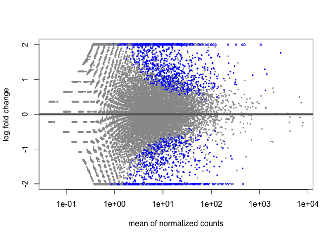<!-- -->

The lower left or upper right of the dots represent the more abundant and variable genes


```r
#plotMA(resLFC, ylim=c(-5,5))
```

## Alternative Shrinkage Estimators: 


```r
#BiocManager::install("apeglm")
library(apeglm)
```


```r
#install.packages("CRAN")
#library(CRAN)
```


```r
resultsNames(dds)
```

```
## [1] "Intercept"           "condition_TNB_vs_HR"
```


```r
resLFC <-lfcShrink(dds, coef=2, type="apeglm")
```

```
## using 'apeglm' for LFC shrinkage. If used in published research, please cite:
##     Zhu, A., Ibrahim, J.G., Love, M.I. (2018) Heavy-tailed prior distributions for
##     sequence count data: removing the noise and preserving large differences.
##     Bioinformatics. https://doi.org/10.1093/bioinformatics/bty895
```


```r
resLFC
```

```
## log2 fold change (MAP): condition TNB vs HR 
## Wald test p-value: condition TNB vs HR 
## DataFrame with 60660 rows and 5 columns
##                     baseMean log2FoldChange      lfcSE    pvalue      padj
##                    <numeric>      <numeric>  <numeric> <numeric> <numeric>
## ENSG00000000003.15 16.763039    5.12115e-06 0.00144269 0.0507525  0.223950
## ENSG00000000005.6   0.200285   -1.01830e-08 0.00144269 0.9788468        NA
## ENSG00000000419.13 34.778701    1.84332e-06 0.00144267 0.6952906  0.875986
## ENSG00000000457.14  4.149625   -2.99755e-06 0.00144269 0.2750129  0.568496
## ENSG00000000460.17  2.655753    4.36480e-06 0.00144269 0.0510602  0.224653
## ...                      ...            ...        ...       ...       ...
## ENSG00000288669.1   0.000000             NA         NA        NA        NA
## ENSG00000288670.1   4.403388   -9.07024e-06 0.00144270  0.052115   0.22812
## ENSG00000288671.1   0.000000             NA         NA        NA        NA
## ENSG00000288674.1   0.000000             NA         NA        NA        NA
## ENSG00000288675.1   0.164325    2.71540e-07 0.00144269  0.757070        NA
```


```r
#install.packages("ashr")
```

```r
library(ashr)
resAsh <- lfcShrink(dds, coef=2, type="ashr")
```

```
## using 'ashr' for LFC shrinkage. If used in published research, please cite:
##     Stephens, M. (2016) False discovery rates: a new deal. Biostatistics, 18:2.
##     https://doi.org/10.1093/biostatistics/kxw041
```

```r
# because we are interested in treated vs untreated, we set 'coef=2'
resNorm <- lfcShrink(dds, coef=2, type="normal")
```

```
## using 'normal' for LFC shrinkage, the Normal prior from Love et al (2014).
## 
## Note that type='apeglm' and type='ashr' have shown to have less bias than type='normal'.
## See ?lfcShrink for more details on shrinkage type, and the DESeq2 vignette.
## Reference: https://doi.org/10.1093/bioinformatics/bty895
```

```r
par(mfrow=c(1,3), mar=c(4,4,2,1))
xlim <- c(1,1e5); ylim <- c(-3,3)
```

```r
plotMA(resLFC, xlim=xlim, ylim=ylim, main="apeglm")
```

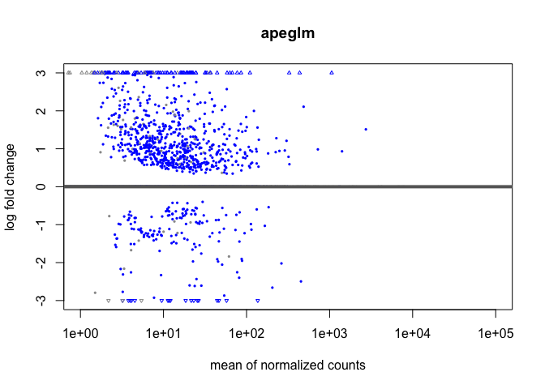<!-- -->

```r
plotMA(resNorm, xlim=xlim, ylim=ylim, main="normal")
```

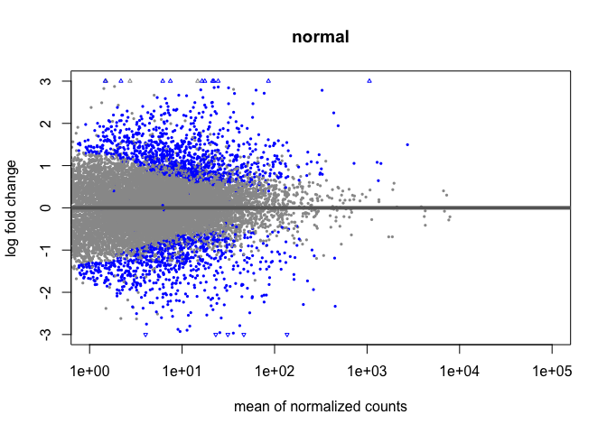<!-- -->

```r
plotMA(resAsh, xlim=xlim, ylim=ylim, main="ashr")
```

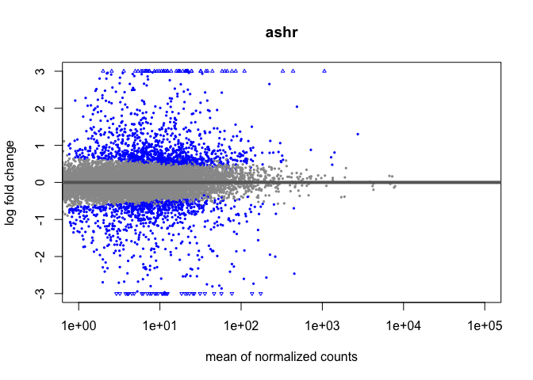<!-- -->


```r
#idx <- identify(res$baseMean, res$log2FoldChange)
#rownames(res)[idx]
```

## Plot counts:


```r
plotCounts(dds, gene=which.min(res$padj), intgroup="condition")
```
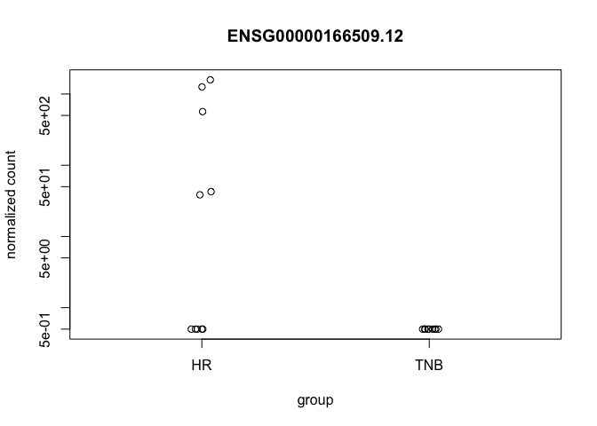<!-- -->


```r
d <- plotCounts(dds, gene=which.min(res$padj), intgroup="condition", 
               returnData=TRUE)
library("ggplot2")
```

```
## 
## Attaching package: 'ggplot2'
```

```
## The following object is masked from 'package:IHW':
## 
##     alpha
```

```r
ggplot(d, aes(x=condition, y=count)) + 
  geom_point(position=position_jitter(w=0.1,h=0)) + 
  scale_y_log10(breaks=c(25,100,400))
```
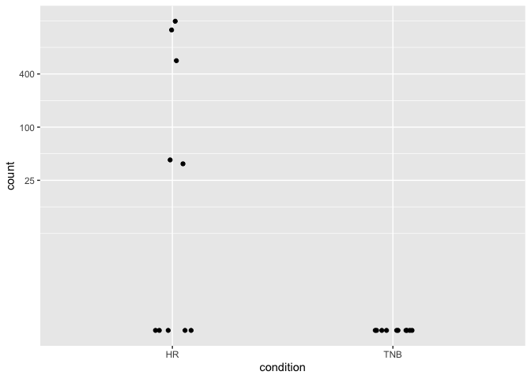<!-- -->


```r
mcols(res)$description
```

```
## [1] "mean of normalized counts for all samples"  
## [2] "log2 fold change (MLE): condition TNB vs HR"
## [3] "standard error: condition TNB vs HR"        
## [4] "Wald statistic: condition TNB vs HR"        
## [5] "Wald test p-value: condition TNB vs HR"     
## [6] "BH adjusted p-values"
```

## Exporting results to CSV files:


```r
resSig <- subset(resOrdered, padj < 0.1)
resSig
```

```
## log2 fold change (MLE): condition TNB vs HR 
## Wald test p-value: condition TNB vs HR 
## DataFrame with 1960 rows and 6 columns
##                     baseMean log2FoldChange     lfcSE      stat      pvalue
##                    <numeric>      <numeric> <numeric> <numeric>   <numeric>
## ENSG00000166509.12  174.2410      -26.41001  2.765292  -9.55053 1.29032e-21
## ENSG00000113739.10  136.4698       -4.80333  0.557945  -8.60897 7.37215e-18
## ENSG00000163220.11 1059.5711        7.30287  0.889897   8.20642 2.27884e-16
## ENSG00000171201.12   38.4589       23.57884  2.957084   7.97368 1.54018e-15
## ENSG00000175356.14   46.4821       -6.41324  0.832525  -7.70336 1.32530e-14
## ...                      ...            ...       ...       ...         ...
## ENSG00000025039.15   4.02516       1.644290  0.662709   2.48116   0.0130954
## ENSG00000230882.1    2.65603      -1.993809  0.803751  -2.48063   0.0131150
## ENSG00000266714.9    2.51196      -1.484500  0.598456  -2.48055   0.0131180
## ENSG00000215375.6    2.20318      -1.393420  0.561765  -2.48043   0.0131224
## ENSG00000117000.9    6.25029       0.899498  0.362754   2.47964   0.0131516
##                           padj
##                      <numeric>
## ENSG00000166509.12 1.92284e-17
## ENSG00000113739.10 5.49299e-14
## ENSG00000163220.11 1.13198e-12
## ENSG00000171201.12 5.73795e-12
## ENSG00000175356.14 3.94991e-11
## ...                        ...
## ENSG00000025039.15   0.0997686
## ENSG00000230882.1    0.0998212
## ENSG00000266714.9    0.0998212
## ENSG00000215375.6    0.0998212
## ENSG00000117000.9    0.0999924
```


```r
#write.csv(as.data.frame(resOrdered), 
#          file="TNB_vs_HR_results.csv")
```

## Data transformations and visualization:

```r
vsd <- vst(dds, blind=FALSE)
rld <- rlog(dds, blind=FALSE)
head(assay(vsd), 3)
```

```
##                    TNB_Sample1 TNB_Sample2 TNB_Sample3 TNB_Sample4 TNB_Sample5
## ENSG00000000003.15   4.0256351   4.1351404   5.1545923   3.9257725    4.784598
## ENSG00000000005.6    0.5097997   0.5097997   0.5097997   0.5097997    2.097901
## ENSG00000000419.13   5.9446349   5.6199396   4.4072348   5.2653460    5.355193
##                    TNB_Sample6 TNB_Sample7 TNB_Sample8 TNB_Sample9 TNB_Sample10
## ENSG00000000003.15   4.7683137   4.8461404   4.5242777   3.7529210    5.0801876
## ENSG00000000005.6    0.5097997   0.5097997   0.5097997   0.5097997    0.5097997
## ENSG00000000419.13   5.2630689   4.9100276   4.5898361   5.5217015    5.1926834
##                    HR_Sample1 HR_Sample2 HR_Sample3 HR_Sample4 HR_Sample5
## ENSG00000000003.15  3.6403883  3.0592161  4.6723777  2.6860000  3.9923254
## ENSG00000000005.6   0.5097997  0.5097997  0.5097997  0.5097997  0.5097997
## ENSG00000000419.13  4.5428115  5.4863203  5.3123200  4.9577438  4.6660461
##                    HR_Sample6 HR_Sample7 HR_Sample8 HR_Sample9 HR_Sample10
## ENSG00000000003.15  2.5952814   3.945269  5.2410956  2.4616817    4.115107
## ENSG00000000005.6   0.5097997   1.672535  0.5097997  0.5097997    1.752255
## ENSG00000000419.13  5.8241916   5.352722  5.4802441  5.0028822    4.719865
```


```r
#extract the matrix of normalized values.
```

```r
#BiocManager::install("vsn")
```

```r
library(vsn)
```

## Effects of transformations on the variance

```r
# this gives log2(n + 1)
ntd <- normTransform(dds)
library("vsn")
meanSdPlot(assay(ntd))
```
<!-- -->


```r
meanSdPlot(assay(vsd))
```
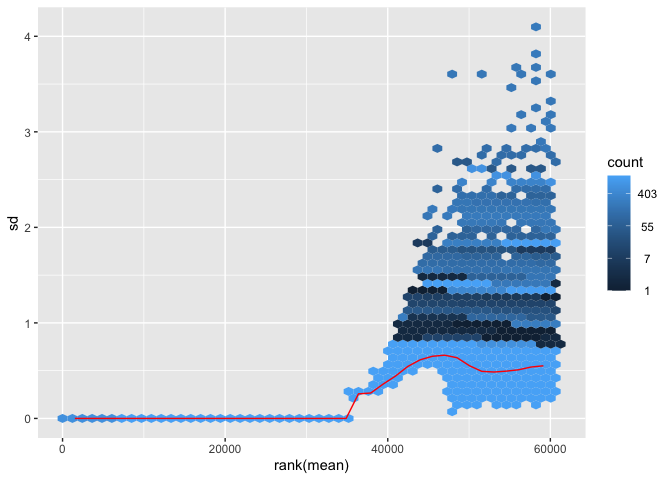<!-- -->


```r
meanSdPlot(assay(rld))
```
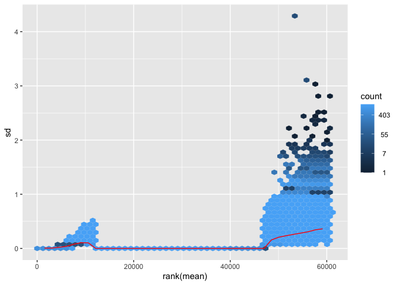<!-- -->

Heatmap of the count matrix:


```r
#install.packages("stringr")
```

## Ensemble name:

```r
V1 <- read.csv("/Users/batulal-zubeidy/Desktop/TRGNFinal/V1.csv", sep = ",")
```

## Symbol name:

```r
V2 <- read.csv("/Users/batulal-zubeidy/Desktop/TRGNFinal/V2.csv", sep = ",")
```

#joining the two tables of V1 (ensemble) and V2(symbol) gene names 

```r
library(dplyr)
```

```
## 
## Attaching package: 'dplyr'
```

```
## The following object is masked from 'package:Biobase':
## 
##     combine
```

```
## The following object is masked from 'package:matrixStats':
## 
##     count
```

```
## The following objects are masked from 'package:GenomicRanges':
## 
##     intersect, setdiff, union
```

```
## The following object is masked from 'package:GenomeInfoDb':
## 
##     intersect
```

```
## The following objects are masked from 'package:IRanges':
## 
##     collapse, desc, intersect, setdiff, slice, union
```

```
## The following objects are masked from 'package:S4Vectors':
## 
##     first, intersect, rename, setdiff, setequal, union
```

```
## The following objects are masked from 'package:BiocGenerics':
## 
##     combine, intersect, setdiff, union
```

```
## The following objects are masked from 'package:stats':
## 
##     filter, lag
```

```
## The following objects are masked from 'package:base':
## 
##     intersect, setdiff, setequal, union
```

```r
Joined <- cbind(V1, V2)
```

```r
#mat.z <- t(apply(mat, 1, scale))
#colnames(mat.z) <- rownames(coldata)
#Testing code below
#testing <- mat.z
#testing <- as.data.frame(testing)
#testing$ensembl <- row.names(testing)
library(dplyr)
#joined <- rename (Joined, 'ensembl' = 'V1')
#testing2 <- full_join(joined, testing, by = "ensembl")
#testing2 <- testing2[-c(1)]
#row.names(testing2) <- testing2$V2
#testing2 <- testing2[-c(1)]
#testing2 <- as.matrix(testing2)
```

```r
#Heatmap(mat.z, cluster_rows = T, cluster_columns = T, column_labels = colnames(mat.z), name = "Z-score")
#Heatmap(testing2, cluster_rows = T, cluster_columns = T, column_labels = colnames(testing2), name = "Z-score")
```


https://github.com/alzubeid/TRGN-510-FINAL-PROJECT/blob/main/README_files/Heatmap.png
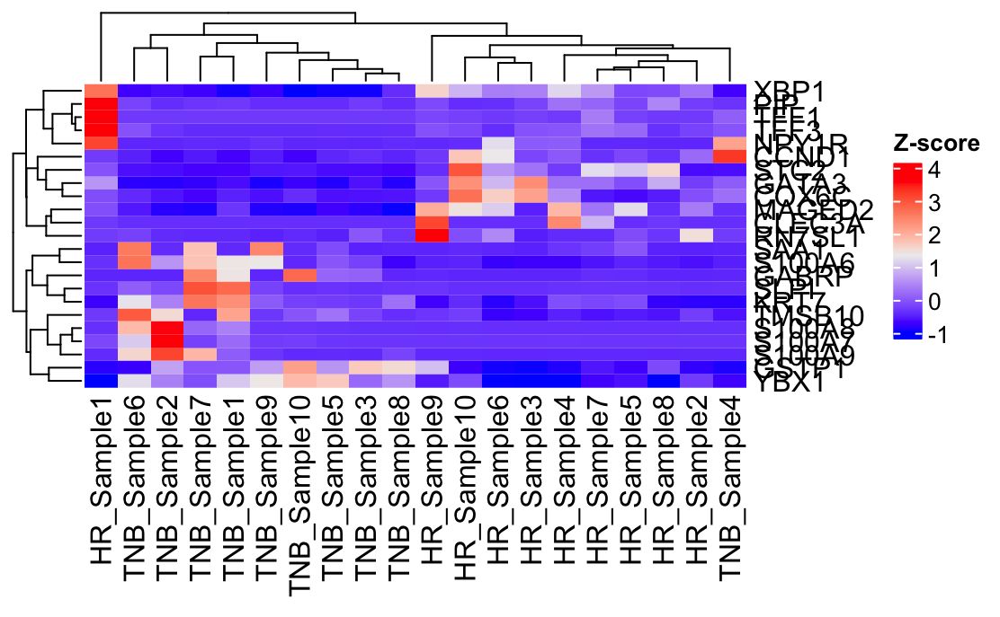<!-- -->


```r
library("pheatmap")
library("stringr")
select <- order(rowMeans(counts(dds,normalized=TRUE)),
                decreasing=TRUE)[1:20]
df <- as.data.frame(colData(dds)[,c("condition")])
colnames(assay(vsd)) <- str_sub(colnames(assay(vsd)), 1, 21)
rownames(df) <- colnames(assay(vsd))
pheatmap(assay(vsd)[select,],cellwidth = 4,cellheight = 8,fontsize_row = 9,fontsize_col =4, annotation_col=df)
```

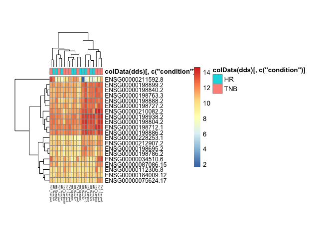<!-- -->

These are the highest 20 genes expressed in the TNB and HR-positive breast cancer patients.  The dark oranage to red represents the highest expression, while the dark blue is the lowerest expression.  


```r
pheatmap(assay(rld)[select,], cluster_rows=FALSE, show_rownames=FALSE,
         cluster_cols=FALSE, annotation_col=df)
```

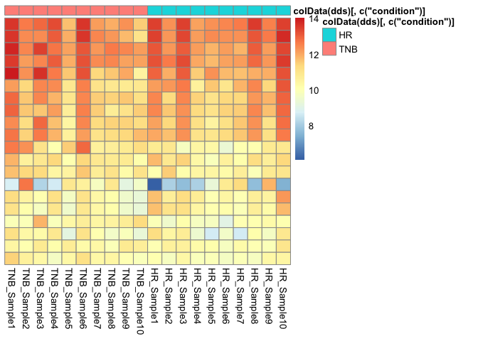<!-- -->

Heatmap of the sample-to-sample distances

```r
sampleDists <- dist(t(assay(vsd)))
```

```r
library("RColorBrewer")
sampleDistMatrix <- as.matrix(sampleDists)
rownames(sampleDistMatrix) <- paste(vsd$condition, vsd$type, sep="-")
colnames(sampleDistMatrix) <- NULL
colors <- colorRampPalette( rev(brewer.pal(9, "Blues")) )(255)
pheatmap(sampleDistMatrix,
        clustering_distance_rows=sampleDists,
         clustering_distance_cols=sampleDists,
         col=colors)
```

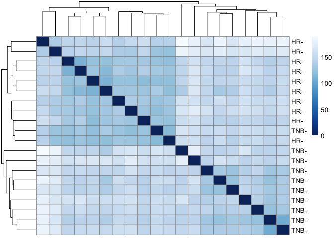<!-- -->

This heatmap gives an idea of how similar are the samples in terms of gene expression. 


Add a new chunk by clicking the *Insert Chunk* button on the toolbar or by pressing *Cmd+Option+I*.

## Principal component plot of the samples


```r
plotPCA(vsd, intgroup=c("condition"))
```

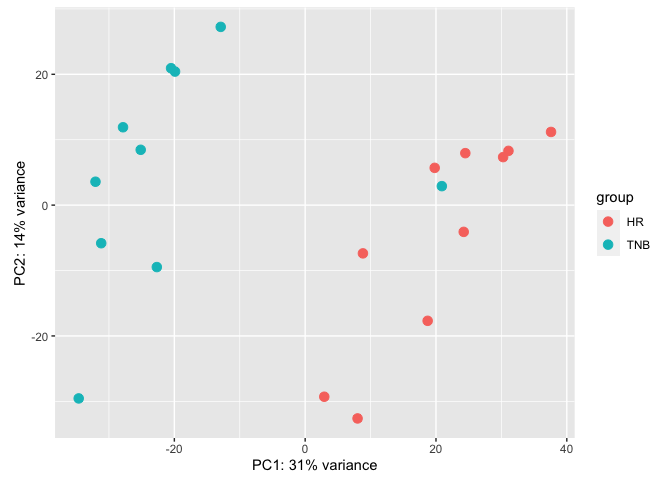<!-- -->

## Conclusion:
1. Triple-negative breast cancer in females appeared to show significant differences in gene expression relative to hormone-receptor-positive breast cancers. ![heatmap] (https://github.com/alzubeid/TRGN-510-FINAL-PROJECT/blob/main/Image%2012-4-22%20at%209.34%20PM.jpeg)

2. The principal component separation plot showed that the two cohorts significantly different. 

3. These differences may overestimate the true genetic alterations between the histological tissue. This overestimation may be due to racial, age-related, or hormonal status.

4. Further study including larger sample sizes should be performed, where race, hormonal status, and stage can be compared.

Known Issues:
-Small sample sizes were used to run the test for differential expression, which likely obsecures the true gene expression.
-The data obtained from TCGA cases were cross examined with portal.gdc.cancer.gov dataset to obtain the clinical pathology, including estrogn/progestrone/HER2 biomarkers.
-The RNA-sequence data showed significantly different PCA analyses between triple negative and estorgen-receptor-positive breast cancer; much greater differences than anticipated.


